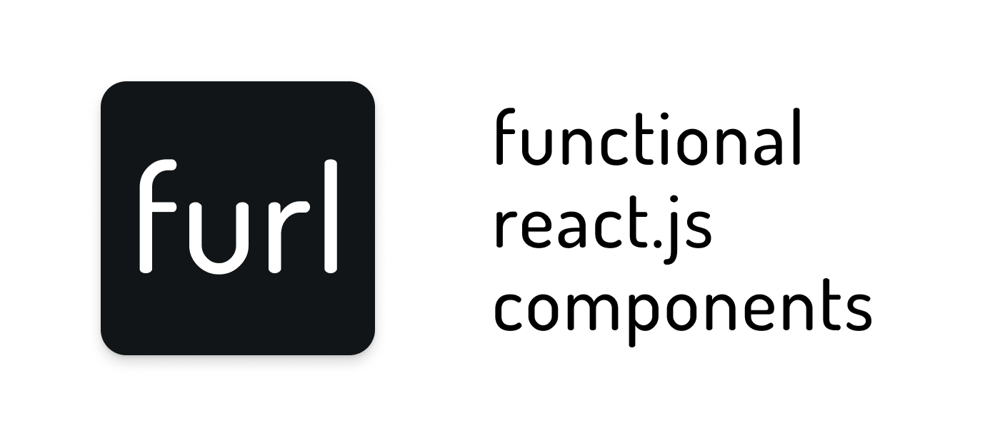

## Getting started

Install **furl** via npm or yarn:

```bash
$ npm install furl-components
```

You should import the fonts into your project yourself, by adding the following line in your HTML `<head>` element:

```html
<link href="https://fonts.googleapis.com/css?family=Open+Sans:300,300i,400,400i,600,600i|Roboto+Mono:300,300i,400,400i,500,500i|Roboto:300,300i,400,400i,500,500i&display=swap" rel="stylesheet" />
```

Finally, you can import the components you want into your components or project, as you can see below:

```jsx
import React from 'react';
import { Button } from 'furl-components';

const App = () => (
  <Button fill='ghost' color='secondary'>
    Click here to continue
  </Button>
);
```